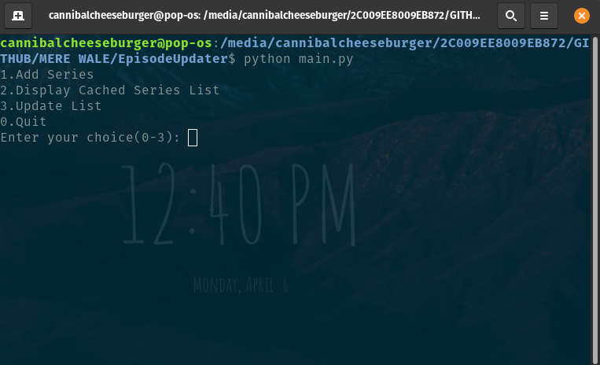
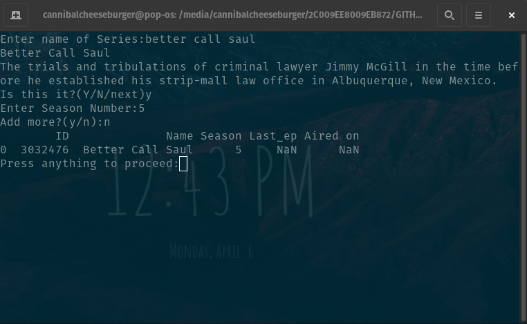
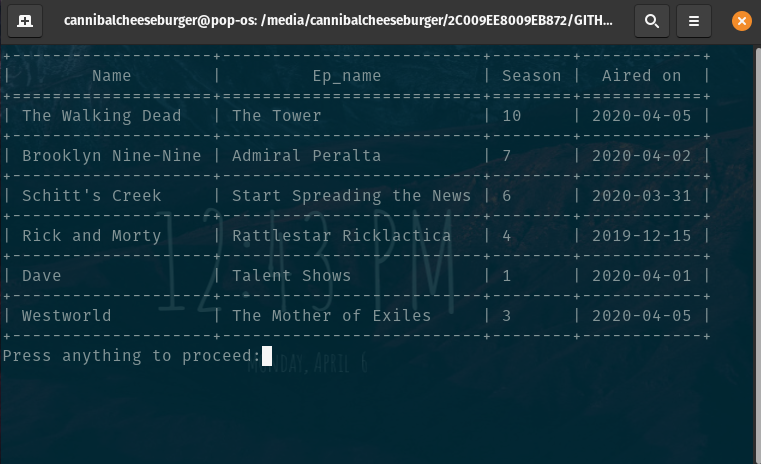
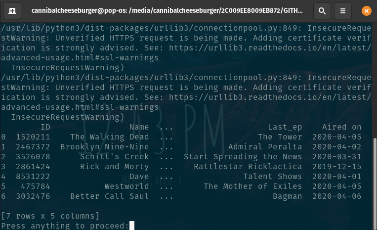

# Episodes Updater

It is a web scraper designed to give the list of latest episodes of choice based on content from <a href="https://www.imdb.com/">imdb.com</a>.

## Installation
---
To install dependencies:

```
pip install -r --user requirements.txt
```
To run:

```
python main.py
```

##  Overview 
---
### 1. Main Menu
 - Select one of the options of your choice
  

### 2. Adding new series to you choice list
 - Enter name of the series you want to add
   - A brief plot of story will appear
   - Answer with Y(YES)/N(NO)/NEXT(LITERALLY NEXT) if it wasn't what you had in mind
 - Enter the season of series you want to stalk
 - Again y/n if you want to add another series to list   



### 3. Display the list 
 - Pretty straight forward



### 4. Update the dates of airing of latest episodes of series
 - Again, couldn't be more straight forward



## APIs
---
Most of the work was done by webscraping but i found these APIs that helped a lot <a href="https://github.com/alberanid/imdbpy">https://github.com/alberanid/imdbpy</a>.
