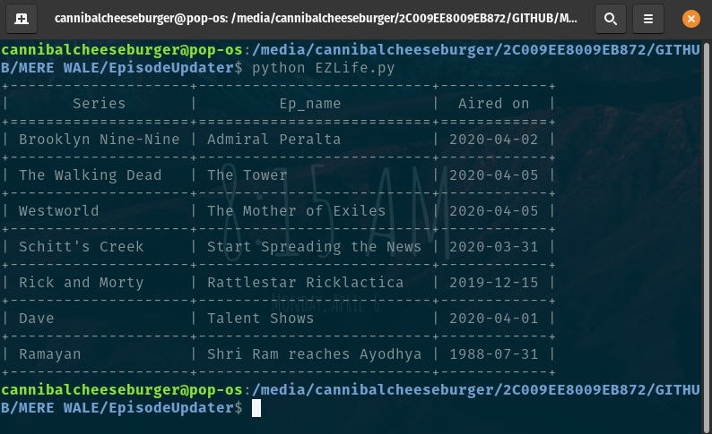

# Episodes Updater

It is a web scraper designed to give the list of latest episodes of choice based on content from <a href="https://www.imdb.com/">imdb.com</a>.

To install dependencies:

```
pip install -r requirements.txt
```
To run:

```
python EZLife.py
```

### A snippet of output: 



For now it just prints the information of last episode aired. 
Gonna change it soon.